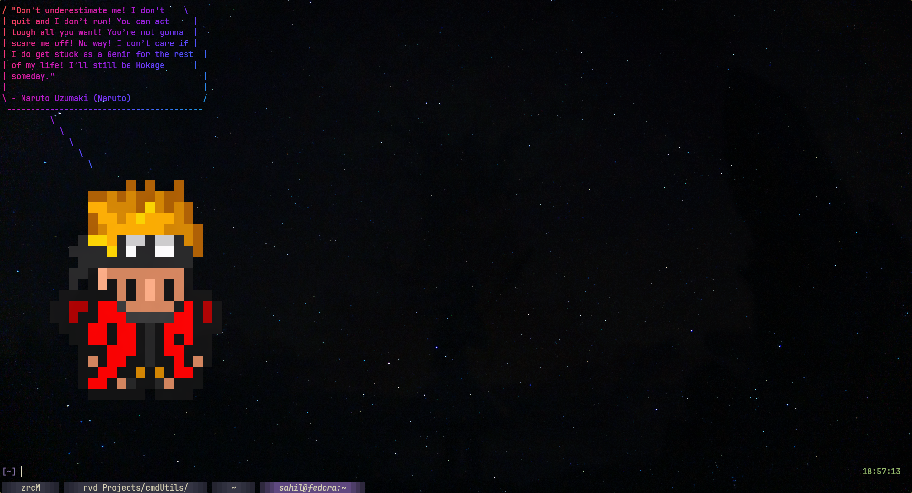

# AniGreeter
A [fortune ](https://en.wikipedia.org/wiki/Fortune_(Unix)) inspired CLI utility that generates anime quotes either:
  1. Randomly
  2. Based on an anime
  3. Based on a Character

## Preview


## Dependencies
- [Go lang (1.23.4 or Higher)](https://go.dev/doc/install)
- [Gorm](https://gorm.io/docs)
- [SQLite (v3)](https://www.sqlite.org/index.html)
- [cobra](https://cobra.dev/)

## Installation
```bash
git clone <this repo>
cd anigreeter
#install the dependencies 
go mod tidy
go build .
# for macs please do mkdir $HOME/.local/bin, then
mv anigreeter $HOME/.local/bin/ 
```

## Usage
```bash
# Get a random quote
anigreeter

# Get a quote from Naruto
anigreeter --anime naruto

# Get a quote from Luffy
anigreeter --character luffy

# Short options work too
anigreeter -a one piece
anigreeter -c light
# anigreeter help
```
## Development
Most of its the same as [Installation](README#Installation),the changes in flow are:
1. After `go mod tidy`, export the **ENV** variable for dev mode i.e. `export ANIGREETER_MODE=dev`
2. To run the application:
```bash
# run the application
go run main.go
# to seed the embedded DB
go run main.go -s
# or
go run main.go --seed
```
> **Note**: Please run `go run main.go` while in the root folder of the repo


## Cowsay integration && lolcat(optional)
1. Install `cowsay`
2. Install `lolcat` for RGB text
3. After that you can copy over the `cowsay sprites` in sprites folder to `/usr/share/cowsay/site-cows/`
   - For **macOS** sometimes its stored in `homebrew/Cellar`, Please execute `cowsay -l` it will tell you where the sprites folder is located 
4. Usage: `anigreeter -c naruto | cowsay -f naruto`
> Supported characters
> 1. Naruto
